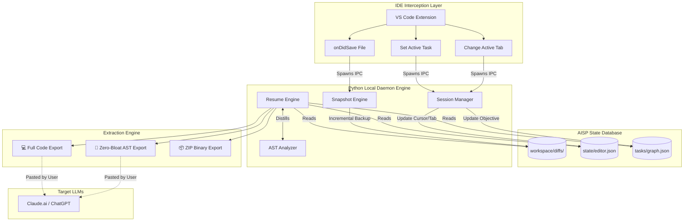

# MemoryBridge (AISP Platform) 🧠⚡

**MemoryBridge** is a production-grade infrastructure platform designed to enable seamless, token-optimized continuation of AI-assisted software development across different AI vendors (Claude, ChatGPT, Gemini) and IDEs (VS Code, Cursor, Windsurf). 

It introduces the **AI Session Protocol (AISP)**—an open specification for transferring complete project architecture, workspace state, and conversation history without hitting context window limits.

---

## 🚀 The Unique Selling Proposition: Zero-Token Bloat

**The Problem:** When developers switch between AI tools (e.g., from Cursor to Claude.ai due to usage limits), they must manually transfer context. Sending raw code files to a new LLM costs **thousands of tokens**, wastes context window space, and degrades AI reasoning.

**The MemoryBridge Solution:** MemoryBridge introduces **Zero-Token Bloat AST Distillation**. 
Instead of sending raw codebase files, our Python-based `ASTAnalyzer` deterministically parses the Abstract Syntax Tree of the project. It extracts only the *architectural skeleton* (Classes, Function Signatures, and exact file paths), omitting all internal logic. 

**Result:** A 5,000-line project is compressed into 100 lines of pure structural context, saving **90% of token costs** while providing the new LLM with a flawless map of your project architecture.

---

## 🏗️ System Architecture



The MemoryBridge system is completely modular and decoupled, consisting of three main layers:

### 1. The IDE Interception Layer (TypeScript / Node.js)
A custom VS Code Extension (`extensions/vscode`) that runs natively in the developer's editor. It silently hooks into IDE lifecycle events:
- **`onDidSaveTextDocument`**: Triggers the snapshot engine to backup exact code states.
- **`onDidChangeActiveTextEditor`**: Tracks exactly which file the developer is looking at.
- **`onDidChangeTextEditorSelection`**: Pinpoints the exact line number of the user's cursor.
- **`aisp.setActiveTask`**: Native UI prompt to define the active engineering objective.

### 2. The Local Daemon Engine (Python)
The heavy-lifting backend (`aisp_core`) that operates entirely offline. It exposes a lightweight CLI that the VS Code extension orchestrates via inter-process communication (IPC).
- **Session Manager** (`session.py`): Manages the localized stateless database (`.ai-session`).
- **Snapshot Engine** (`snapshot.py`): Performs highly efficient file diffing and backups upon IDE saves.
- **AST Analyzer** (`ast_analyzer.py`): Dynamically reads code structures to extract structural skeletons.

### 3. The Extraction & Context Engine (Python)
The core `ResumeEngine` (`resume.py`) converts the raw local database into heavily optimized markdown prompts designed for immediate injection into standard LLMs. It supports three export modes:
1. **🧠 Zero-Token Bloat (AST Struct)**: Exports the exact project architecture without logic bodies.
2. **💻 Full Code Context**: Exports the recent file source code.
3. **📦 ZIP Package**: Compresses the session state into an uploadable binary.

---

## 📂 The AISP Standard Protocol

All data is stored locally in the workspace under a `.ai-session/` directory, ensuring zero vendor lock-in and complete privacy.

```text
.ai-session/
├── metadata.json           # Core project identifiers and timestamps
├── state/
│   └── editor.json         # Real-time state: Active tab, open tabs, exact cursor line
├── tasks/
│   └── graph.json          # Directed graph of current, pending, and completed tasks
└── workspace/
    └── diffs/              # Timestamped historical backups of saved files
```

---

## 🤖 Integrated GenAI Capabilities

MemoryBridge isn't just a static extractor; it includes active AI agents powered by the **Gemini 2.5 Flash SDK** (`gen_ai.py`).
- **LLM Wiki Engine**: Instead of relying on expensive Vector Databases (RAG), this engine acts as a background agent. It reads the file diffs you create and automatically updates a synthetic, highly compressed `wiki.md` file summarizing the project's knowledge base.
- **Proactive Predictor**: A background daemon that can analyze traceback errors and terminal output, independently querying Gemini to suggest architectural fixes before you even ask.

---

## ⚙️ Getting Started & Testing

MemoryBridge is currently designed to be run as a Development Extension in VS Code.

1. **Install Dependencies**:
   Ensure you have Python installed and run: `pip install google-genai tenacity pydantic`
2. **Launch the Extension**:
   - Open the `extensions/vscode` folder in VS Code.
   - Press **F5** to start the Extension Development Host window.
3. **Test on Any Project**:
   - In the new VS Code window, open *any* of your existing projects.
   - Press `Ctrl+Shift+P` and select **`AISP: Initialize AI Session`**.
   - Press `Ctrl+Shift+P` and select **`AISP: Set Active Task`** to define your goal.
   - Click around your code and save a file.
   - Finally, run **`AISP: Generate Resume Prompt`** to experience the Zero-Token Bloat extraction.
