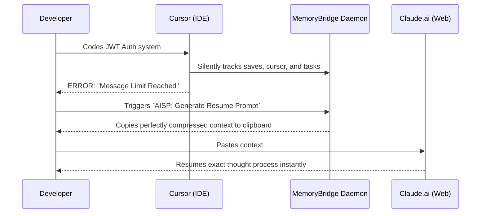
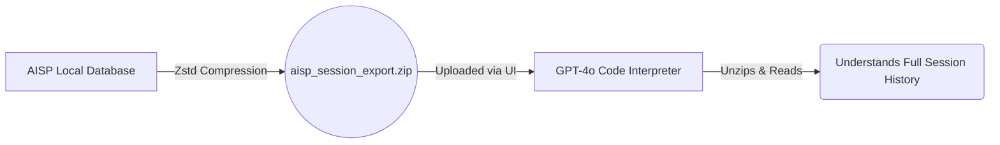

# MemoryBridge: Expected Output & Impact 🧠⚡

This document outlines a real-world scenario demonstrating exactly how MemoryBridge (AISP) behaves when an AI session is cut off, and how its three distinct extraction engines output context to save the developer's workflow.

---

## 🛑 The Scenario: The "Cutoff"
You are building a complex Authentication system in **Cursor**. You have spent 3 hours debugging a JWT token issue. Suddenly, you hit your **Premium Message Limit**. You are forced to switch to the free web version of **Claude.ai** to finish the task. 

Without MemoryBridge, Claude.ai has zero context. You would have to manually explain the last 3 hours of work and paste 10 different files.

With MemoryBridge, the transition is mathematically automated.



---

## 📤 Expected Outputs by Mode

When you trigger the MemoryBridge VS Code Extension to transfer your session, you can choose from three distinct strategies depending on the target LLM's capabilities.

### Mode 1: 🧠 Zero-Token Bloat (AST Struct)
*Best for: Massive codebases (100+ files) where sending raw code would break the context window.*

This is MemoryBridge's **Unique Selling Proposition**. It completely strips away code logic and only extracts the Abstract Syntax Tree (AST), saving 90% of token bandwidth while providing perfect architectural context.

**Expected Clipboard Output:**
```markdown
# AISP Resume Context (MemoryBridge)

**Project Name**: Enterprise-Auth-System
**Primary Language**: python

## Current Objective
Implementing JWT refresh token rotation strategy.

## Editor State
**Active File**: `backend/auth/jwt_handler.py`
**Cursor Position**: Line 42

---
*INSTRUCTION FOR AI: You have been restored into this session. Please analyze the 'Current Objective' and the 'Active File', and continue the implementation seamlessly. Do not regenerate existing codebase scaffolding.*

# 🧠 AST Architectural Context (Zero-Token Bloat)
The following is the deterministic project skeleton. Implementation details are omitted to save context limits.

### File: backend\auth\jwt_handler.py
class JWTManager:
    def __init__(self, secret_key): ...
    def generate_token(self, user_id): ...
    def verify_token(self, token): ...
    def rotate_refresh_token(self, old_token): ...

### File: backend\models\user.py
class User:
    def __init__(self, email, password_hash): ...
    def check_password(self, plain_text): ...
```
*Impact:* Claude now knows exactly what classes and methods exist across your entire backend, without wasting 10,000 tokens reading the `if/else` logic inside them.

---

### Mode 2: 💻 Full Code Context
*Best for: Highly localized debugging where the new AI needs to see the exact implementation of the file you are currently working on.*

This mode appends the actual source code of the files you have saved in the last 15 minutes by pulling from the `.ai-session/workspace/diffs/` database.

**Expected Clipboard Output:**
```markdown
# AISP Resume Context (MemoryBridge)
[... Basic Metadata and Task Objective ...]

## Recent Code Context

### Modified File: 1782647565_jwt_handler.py
```python
import jwt
from datetime import datetime, timedelta

class JWTManager:
    def __init__(self, secret_key):
        self.secret = secret_key

    def rotate_refresh_token(self, old_token):
        # TODO: Implement revocation list checking
        pass
```
```
*Impact:* Claude can immediately see the `TODO` you were looking at right before the session crashed, allowing it to write the exact lines of code you need to finish the `rotate_refresh_token` function.

---

### Mode 3: 📦 ZIP Archive Export
*Best for: Advanced Agentic LLMs (like GPT-4o with Code Interpreter or Gemini Advanced) that can natively unpack and analyze file directories.*

Instead of generating a text prompt, MemoryBridge compiles the entire `.ai-session` database into a highly compressed `aisp_session_export.zip` binary file.

**Expected Workflow:**
1. The extension generates the `.zip` file in your root folder.
2. You drag and drop the `.zip` file directly into the ChatGPT interface.
3. You type: *"Read the AISP session data and resume my work."*


*Impact:* The AI has access to your entire chronological thought process (via `events.jsonl` and `graph.json`), acting as a true "Brain Upload" rather than just a code dump.
