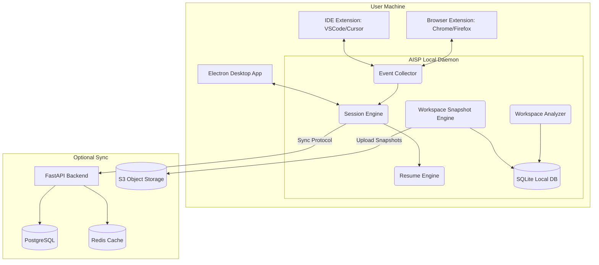
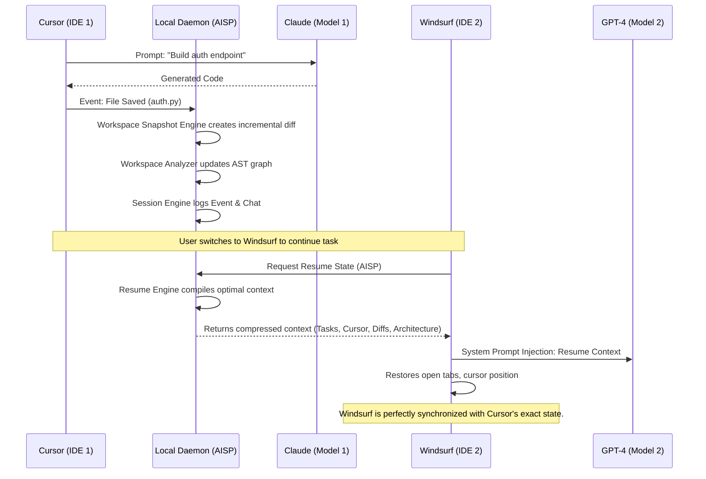

# System Architecture: MemoryBridge (AISP Platform)

## 1. High-Level Architecture Overview

MemoryBridge is designed as a distributed, local-first platform consisting of five major systems:
1. **Event Collector**: IDE & Browser extensions capturing telemetry and actions.
2. **Workspace Analyzer**: Local parsers constructing ASTs and dependency graphs deterministically.
3. **Workspace Snapshot Engine**: Core engine for generating Zstd-compressed incremental diffs.
4. **Session Engine**: The local SQLite-backed engine maintaining timelines, tasks, and state.
5. **Resume Engine**: Context-compression module that prepares the optimal prompt for the next LLM.

### Cloud Integration (Optional)
- **FastAPI Backend**: Manages session metadata, user authentication, and coordinates synchronization.
- **Object Storage (S3/R2)**: Stores large `.tar.gz` baselines and heavy delta patches.
- **PostgreSQL**: Stores relational data (users, session metadata, permissions).

---

## 2. Component Diagram

---

## 3. Sequence Diagram: Session Transfer (Cursor to Windsurf)

---

## 4. Snapshot & Compression Strategy

1. **Format**: Uses Zstandard (`zstd`) for high-ratio, high-speed compression of text/code.
2. **Algorithm**: Myers diff algorithm or standard Git delta compression.
3. **Trigger**: 
   - Debounced on file save (e.g., 2 seconds of inactivity).
   - Immediate on AI response completion.
   - Immediate on Terminal execution completion.
4. **Storage**: Patches are written to `.ai-session/workspace/diffs/`.

---

## 5. Synchronization Strategy

The platform supports three distinct modes:
1. **Mode 1 (Local Only)**: No cloud contact. Entire `.aisession` is handled strictly on the filesystem.
2. **Mode 2 (Cloud Sync - Metadata)**: Only task graphs, conversation history, and project state sync via FastAPI. The codebase itself does not leave the machine. (Privacy optimized).
3. **Mode 3 (Full Session Sync)**: Snapshots (deltas and baselines) are chunked and streamed directly to S3 via pre-signed URLs provided by the FastAPI backend.

---

## 6. Object Storage Strategy

- **Storage Provider**: AWS S3, Cloudflare R2, or MinIO.
- **Data Structure**:
  - `s3://aisp-sessions/{user_id}/{session_id}/base.tar.zst`
  - `s3://aisp-sessions/{user_id}/{session_id}/diffs/{timestamp}_{hash}.patch`
- **Security**: Objects are AES-256 E2E encrypted client-side before upload. The cloud provider only sees encrypted blobs.

---

## 7. Electron Desktop Architecture

The desktop application serves as the command center for AISP sessions.
- **Frontend**: React + TypeScript + TailwindCSS.
- **Backend (Main Process)**: Node.js bridging to the AISP Local Daemon (Rust/Go or Python).
- **Features**:
  - Visual timeline of the project evolution.
  - Snapshot diff viewer.
  - Global search across all indexed `.aisession` SQLite databases.
  - Cloud sync management.
